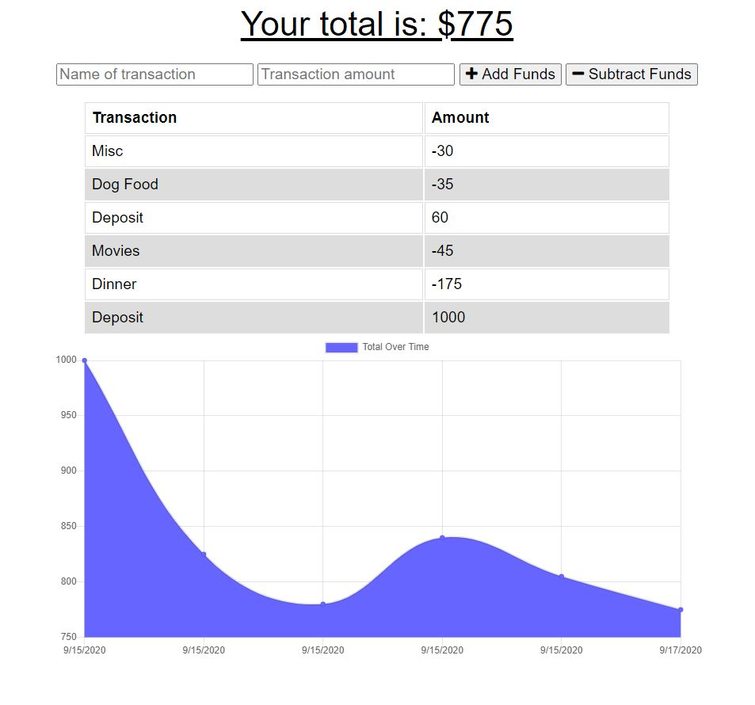

# Budget-Tracker

Budget Tracker is an application that allows the user to add expenses by adding adding deposits and deductions as well as tracking money spent. 

This application is fully functional offline and will populate the total when brought back online. 

---

# User Story:

> AS AN avid traveler
>
>I WANT to be able to track my withdrawals and deposits with or without a data/inernet connection
>
>SO THAT my account balance is accurate when I am traveling 

---
# Techonologies Used:
HTML, CSS, JavaScript, MongoDB

NPM Packages: Express, Morgan, Mongoose, Compression

# Demo:
Application deployed through <a href="https://young-taiga-58060.herokuapp.com/">Heroku</a>

